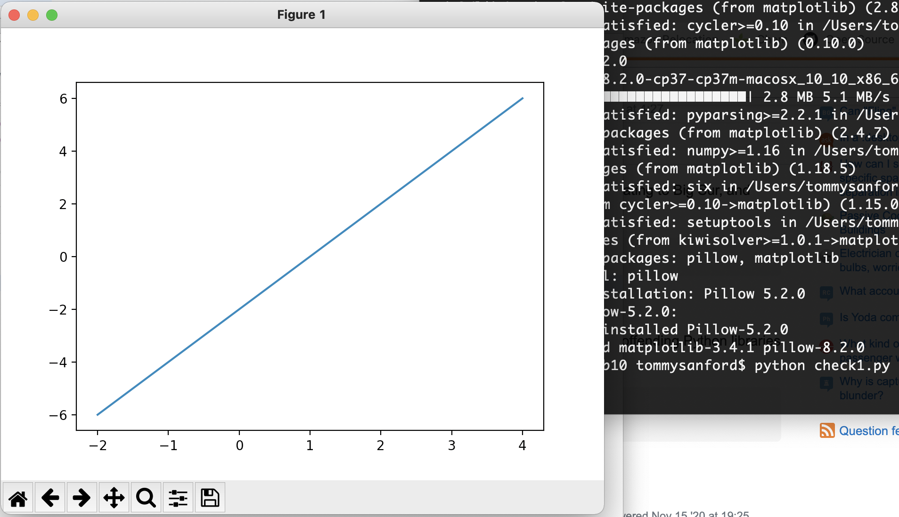
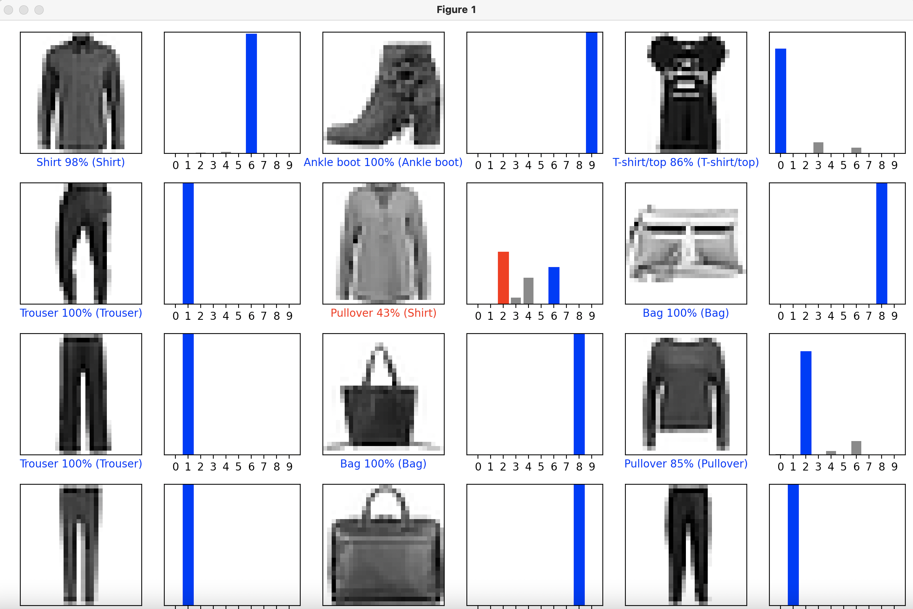
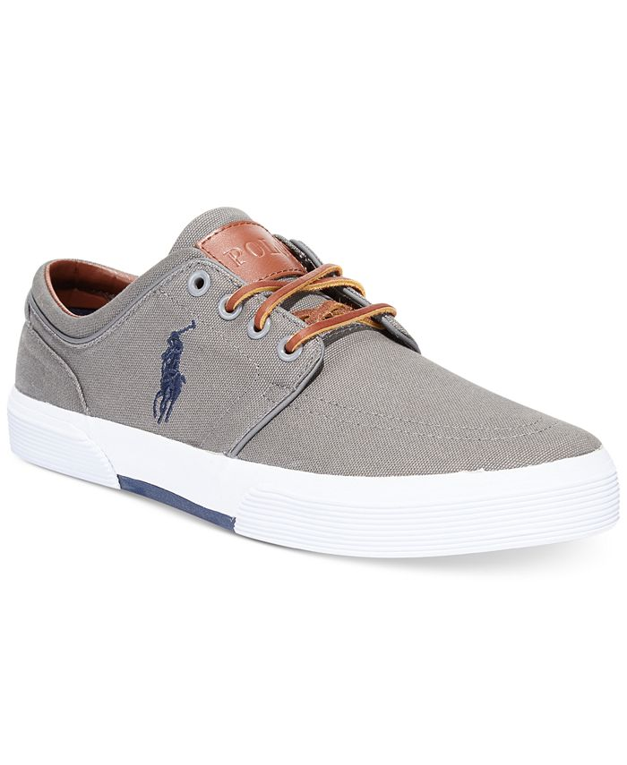
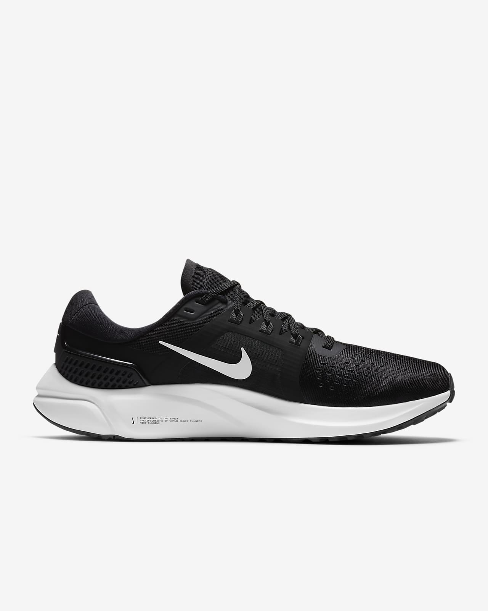
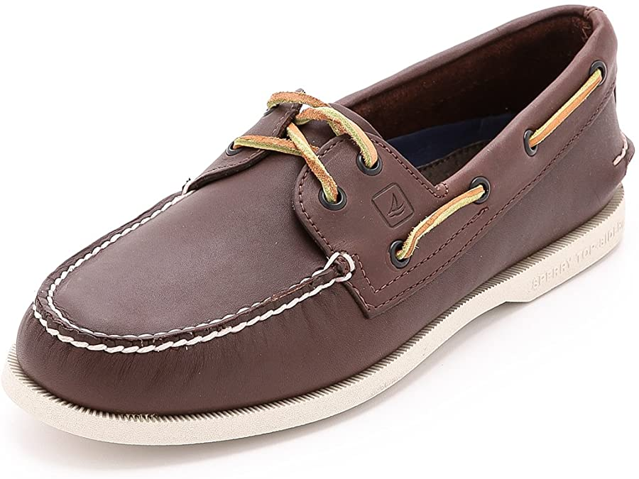
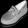
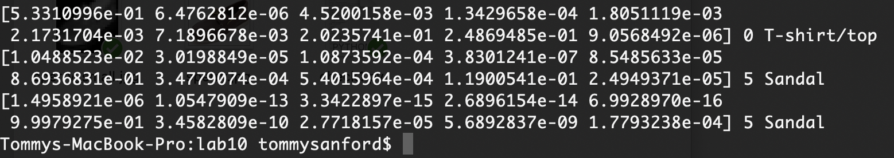

# Lab 10 - Tommy Sanford

## Checkpoint 1

## Checkpoint 2

## Checkpoint 3

`[5.3310996e-01 6.4762812e-06 4.5200158e-03 1.3429658e-04 1.8051119e-03
 2.1731704e-03 7.1896678e-03 2.0235741e-01 2.4869485e-01 9.0568492e-06] 0 T-shirt/top`
 
 
 

`[1.0488523e-02 3.0198849e-05 1.0873592e-04 3.8301241e-07 8.5485633e-05
 8.6936831e-01 3.4779074e-04 5.4015964e-04 1.1900541e-01 2.4949371e-05] 5 Sandal`

`[1.4958921e-06 1.0547909e-13 3.3422897e-15 2.6896154e-14 6.9928970e-16
 9.9979275e-01 3.4582809e-10 2.7718157e-05 5.6892837e-09 1.7793238e-04] 5 Sandal`
 
 
 
 I would say that 2/3 of my predictions are correct. The Polo shoe prediction said it is a T-Shirt which is completely wrong, but the other two said Sandal which for the Sperry shoe is accurate however the Nike shoe is more so a sneaker but it does look structurally like a Sandal.