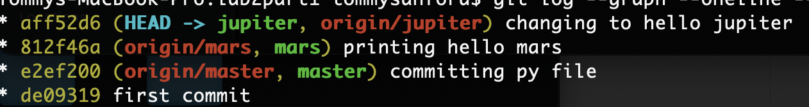
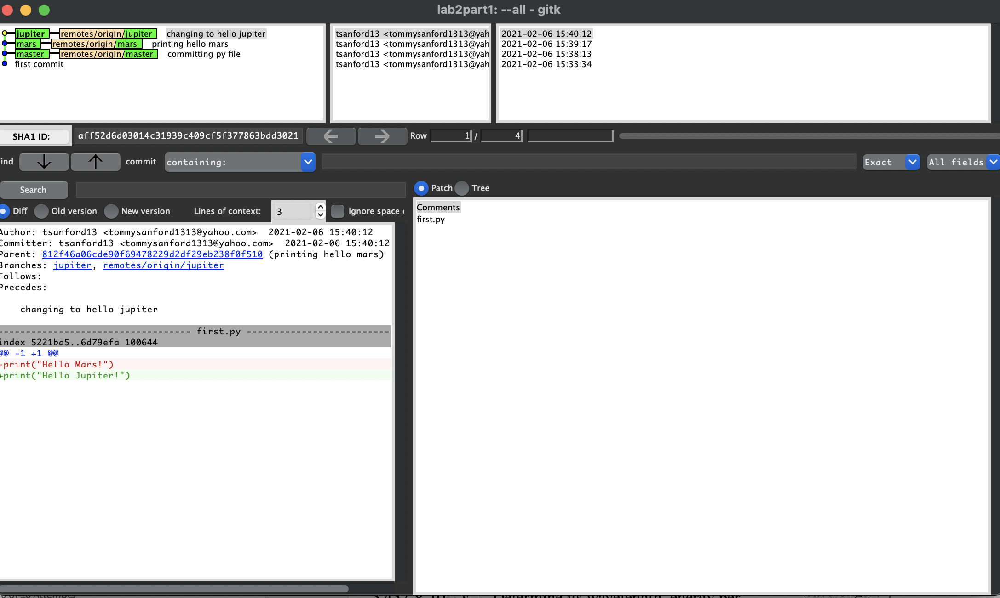
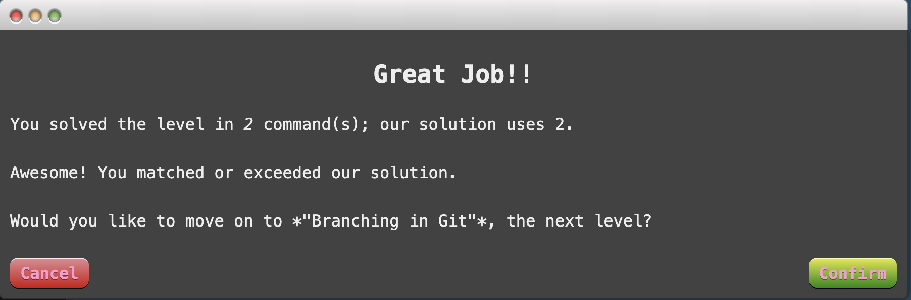
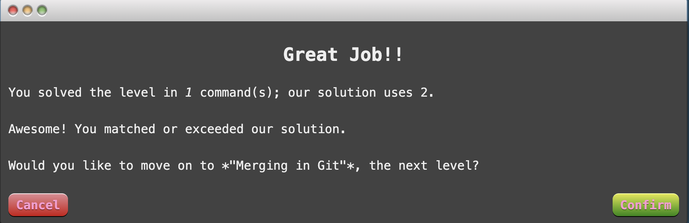
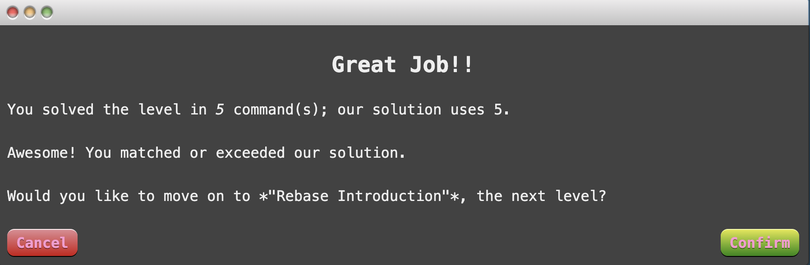
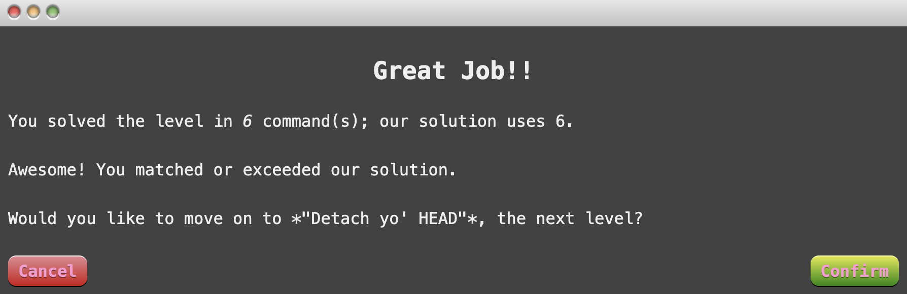
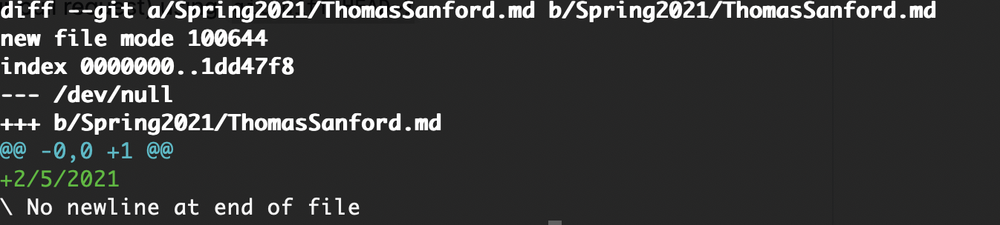
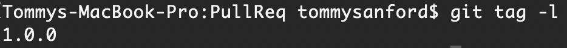

# Open Source Software - Spring 2021
## Tommy Sanford

### Junior CS Major - Graduating Dec. 2021
[Lab2Part1 Repo](https://github.com/tsanford13/lab2part1)

[Lab2Part2 Spoon-Knife Fork](https://github.com/tsanford13/Spoon-Knife)

[Lab2Part3 PR Fork](https://github.com/tsanford13/PullReq)

[Lab2Part3 Ideas Fork](https://github.com/tsanford13/OSSProjectIdeas)