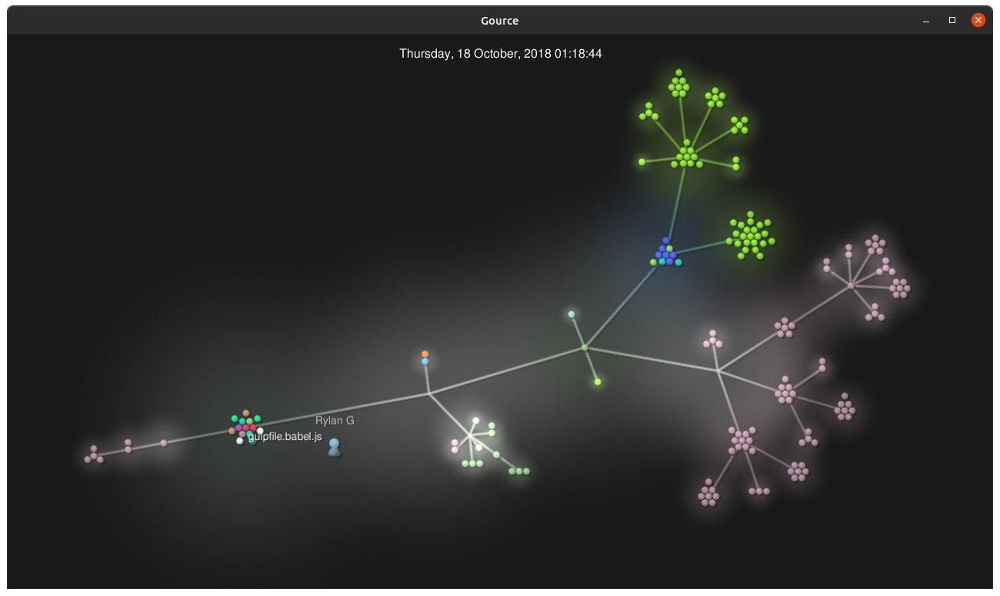

## Part 1
1. ✅
2. https://github.com/tsanford13/OSS-Labs/wiki
3. LaTeX generated PDF for parts 3 and 4 [PDF](lab3.pdf) [Raw LaTex](main.tex)
## Part 2
**RCOS Project: SMAB**

* Number of Contributors: 2

* Number of Lines of Code: 1606

* First Commit: 9/18/20 "Initial commit" [here](https://github.com/SeanMiller969/SMAB/commit/d6eb67161dade78a5237a4b6cf7a109fedb74387) 

* Latest Commit: 12/09/20 "Update README.md" [here](https://github.com/SeanMiller969/SMAB/commit/f099ec61dc7a58080079a32e48e05a8d96bae991) 

* Current Branches: There are 5 [current branches](https://github.com/SeanMiller969/SMAB/branches) (master, URLtraverseandJSON, User-Interface, Class-Files, and rmupdate)

* Gitstats reported 1590 lines of code (16 line difference).

**RCOS Project: Shuttle Tracker** [from](https://github.com/christinekoul/oss-repo/blob/master/labs/lab-03/lab3.md)

 * 33 contributors
 * 62080 total lines of code
 * first commit: https://github.com/wtg/shuttletracker/commit/3453b12cb6d53080a0967644eddf44111fef0c54
 * latest commit: https://github.com/wtg/shuttletracker/commit/b98b319901c248df6b1daffe7782041914411b46
 * 55 current branches
 * 9 active branches:
      * eta_refactored
      * smooth-tracking-algorithm-2
      * smooth-tracking-predict-light-stops
      * update-headings
      * shuttle-slide
      * smooth-tracking
      * feedback2
      * update_Package
      * smooth-tracking-predict-turns

* gitstats:
 * 39 contributors (compared to 33)
 * 52719 total lines of code (compared to 62080)

**RPI CampusMap** [from](https://github.com/kevinb5617/oss-kb/blob/master/labs/lab-03/Lab3.md)

* 12 Contributors
* 37207 lines of code
* Initial commit: ["Initial commit"](https://github.com/gaskij/rpicampusmap/commit/5addd28)
* Latest commit: ["Merge pull request #153 from gaskij/dependabot/npm_and_yarn/campusmap/axios-0.21.1"](https://github.com/gaskij/rpicampusmap/commit/2b735c7)
* Branches
    * master
    * readmeupdate
    * bugfix/update-leaflet
    * docs/cas
    * feature/auth-context
    * feature/login_page
    * dev
    * live_location_tracking
    * feature_prof_search
    * legacy
    * feature/comment-api

* gitstats
	* Lines: 21118

**Open Circuits** [from](https://github.com/TGCrystal/oss-labs/blob/master/labs/lab-03/report.md)

* 33 contributors
* 26796 lines of code
* First commit: https://github.com/OpenCircuits/OpenCircuits/commit/c4a9e7d66d32391f9371a68a0749588a6218b5b3
* Last commit: https://github.com/OpenCircuits/OpenCircuits/commit/33296784ecf4fabf6b2439e04540049b15fcb26a
* Branches:
  * origin/AnalogWork
  * origin/Browser-compatibility-(version,-etc.)
  * origin/Documentation
  * origin/HEAD -> origin/master
  * origin/ICLibrary
  * origin/MUXLabel
  * origin/MainTutorial
  * origin/Optimizations
  * origin/PlaceComponentFix
  * origin/Replace_Component
  * origin/SelectionToolTest
  * origin/Snap_Options
  * origin/TashBranch
  * origin/UnitTests
  * origin/VideoTutorialPage
  * origin/all
  * origin/db-versioning
  * origin/expression-to-circuit
  * origin/master
  * origin/port-8081
* Gitstats says there is only 26335 lines of code and 41 contributors
* gource: 
