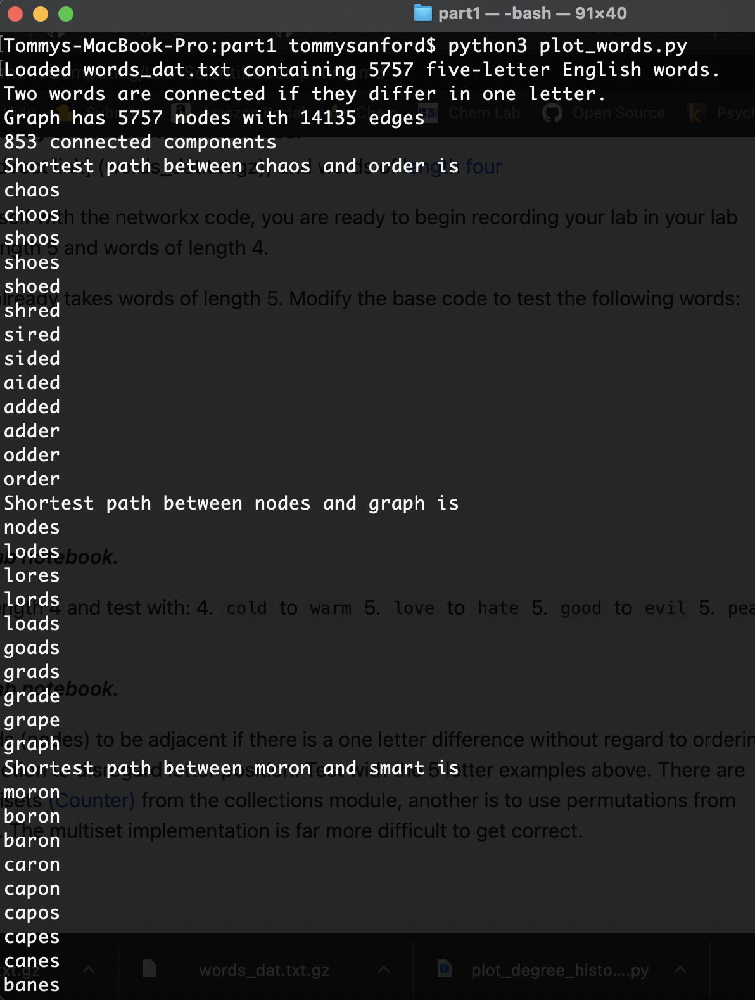
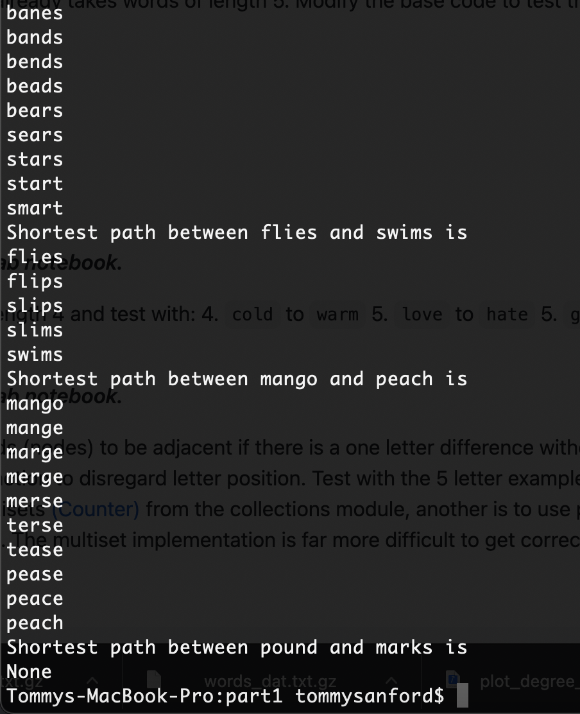
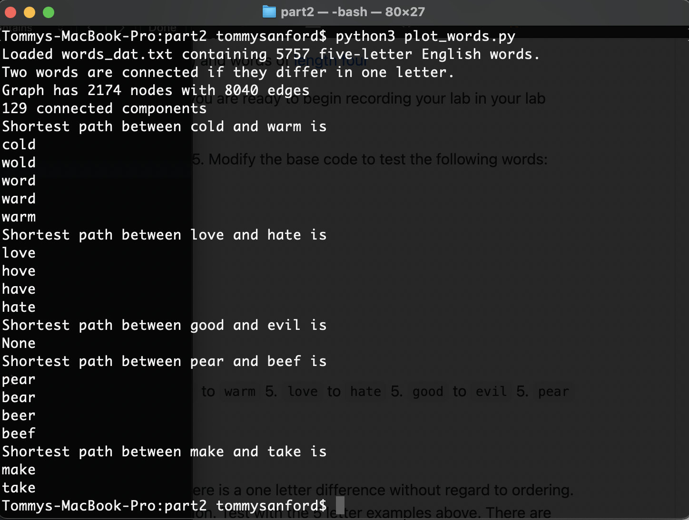
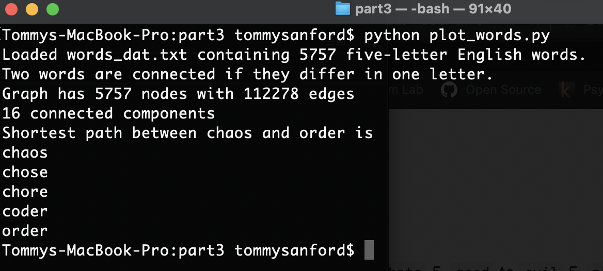

## Part 1

Code: [plot_words.py](part1/plot_words.py)

Screenshots of Output:

## Part 2

Code: [plot_words.py](part2/plot_words.py)

Screenshot of Output:

## Part 3

Code: [plot_words.py](part3/plot_words.py)

Screenshot of Output:

