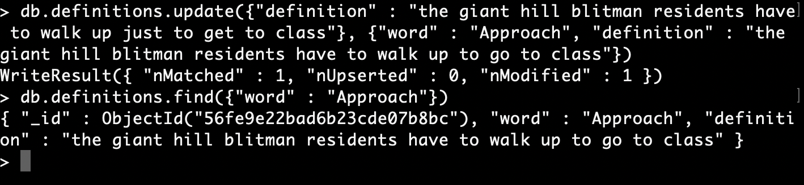

# Lab 9 - Tommy Sanford

## Checkpoint 1

## Checkpoint 2

## Checkpoint 3

[Part 3 git diff (as txt file)](images/part3_gitdiff.txt)

## Checkpoint 4

[checkpoint4.py Script](checkpoint4.py)

[PPrint Output](pprintout.txt)

## Checkpoint 5
[checkpoint5.py Script](checkpoint5.py)

